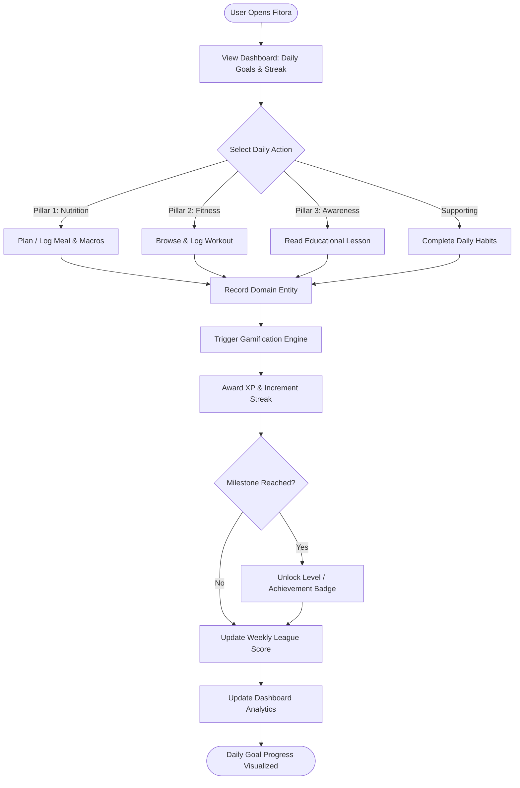

# Application Flow: Fitora

This document describes the primary user flows, state transitions, and sequence diagrams across the **Fitora** platform.

---

## 🔄 The Core Daily Engagement Loop

The user experience in Fitora centers around an empowering daily active loop that connects the Big 3 pillars with supporting gamification:

---

## 🧭 Key User Journeys

### 1. Onboarding & Baseline Calibration
1. **Sign Up**: User enters email, username, and password.
2. **Biometric Input**: User inputs age, biological sex, height, weight, activity tier, and primary goal (e.g., maintain weight, fat loss, muscle building).
3. **Caloric & BMI Calculation**: System computes initial BMI context and daily estimated caloric requirements (maintenance and target).
4. **Disclaimers Accepted**: User reviews educational disclaimer (BMI is a screening tool, not medical advice).
5. **Initial Habit Selection**: User selects 3–5 baseline habits to initiate their daily routine.
6. **First XP Grant**: Welcome XP is awarded, placing the user in their introductory League cohort.

### 2. Nutrition Logging Flow
1. User selects meal type (Breakfast, Lunch, Dinner, Snack).
2. User searches or selects food item, specifies portion/weight.
3. System fetches calories and macronutrient ratios (protein, carbohydrates, fat).
4. System persists meal record and updates daily progress bars against target budget.
5. Gamification engine increments nutrition consistency counter and awards XP.

### 3. Workout Logging Flow
1. User enters Fitness Hub and selects a workout routine or starts an empty session.
2. User selects exercises from the exercise library.
3. User logs sets, reps, and resistance weight for each completed set.
4. User taps "Finish Workout".
5. System calculates total volume (sets × reps × weight) and workout duration.
6. System saves workout history log and updates weekly fitness frequency.
7. Gamification engine awards workout XP and checks off the workout habit (if configured).

### 4. Awareness Lesson Flow
1. User visits Awareness Center and selects an unread lesson (e.g., *"Why Protein Matters for Muscle Repair"*).
2. User reads the concise 2–3 minute evidence-based explanation.
3. User completes lesson checkpoint / marks as read.
4. System marks lesson as completed for the user profile.
5. Gamification engine awards educational XP and increments awareness streak.

### 5. Habit Tracking & League Ranking Flow
1. User views daily habit checklist on Dashboard or Habit Center.
2. User toggles completed items (e.g., Drink 2.5L Water, Sleep 8 Hours).
3. System saves habit log entry with date timestamp.
4. System recalculates habit-specific streak and overall daily activity streak.
5. XP is dispatched to the user's weekly league tally.
6. League leaderboard reflects updated position within the weekly cohort.

---

## 📝 Planned Decisions / TODOs

- [ ] **TODO: [Flow]**: Finalize whether users can backdate meal logs and workout logs (e.g., logging yesterday's dinner) and how that impacts streaks.
- [ ] **TODO: [Flow]**: Determine whether incomplete workouts can be saved as drafts locally or on the server.
