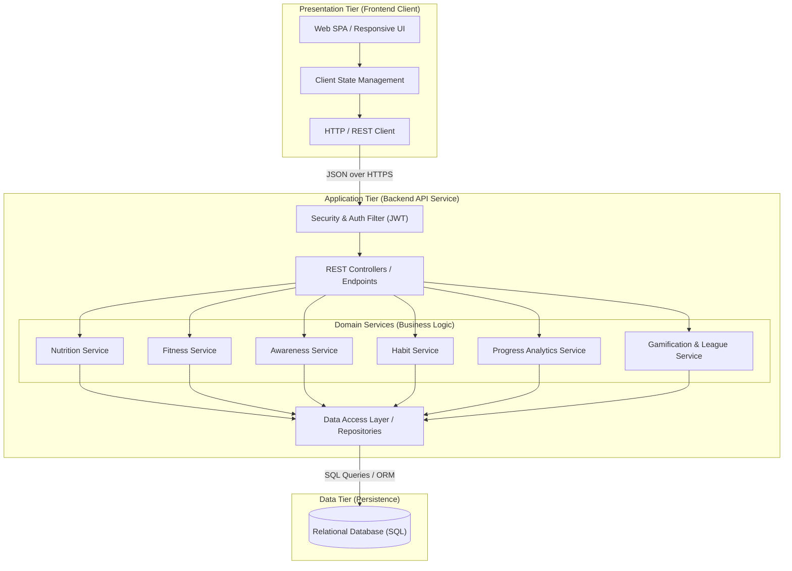

# System Architecture: Fitora

> **GOVERNANCE NOTICE: PROPOSED / CANDIDATE — NOT APPROVED**  
> The layered architectural pattern, component assignments, and service breakdown described below represent candidate proposals only. The final system architecture remains **TODO / UNDECIDED**.

This document describes the high-level system architecture, design patterns, and structural boundaries of **Fitora**.

---

## 🏛️ Layered Architectural Pattern

Fitora is designed as a classic **N-Tier Layered Architecture**. Each tier is decoupled with clear interfaces and single responsibilities to ensure testability, maintainability, and scalability.

---

## 🏢 Tier Breakdown

### 1. Presentation Tier (Frontend Client)
- **Role**: Render user interfaces, capture user interactions, manage transient local state, and communicate with the backend via RESTful endpoints.
- **Characteristics**: Single Page Application (SPA) architecture, component-based design system, reactive state binding, responsive mobile/desktop layouts.

### 2. API & Security Layer
- **Role**: Entry point for HTTP requests. Handles request validation, authentication token verification (JWT), CORS headers, rate limiting, and mapping requests to appropriate service handlers.

### 3. Domain Service Layer (Business Logic)
Contains pure business logic and rule enforcement:
- **Nutrition Service**: Calculates BMI context, calculates BMR/TDEE targets, verifies daily calorie limits, and aggregates macro totals.
- **Fitness Service**: Handles exercise querying, workout log validation, and session duration calculations.
- **Awareness Service**: Manages educational lessons, tracks lesson completion, and triggers reading rewards.
- **Habit Service**: Manages daily habit rosters, records completion states, and updates individual habit streaks.
- **Progress Service**: Aggregates time-series data for daily, weekly, and monthly dashboard charts.
- **Gamification Service**: Intercepts completed actions, awards XP, triggers level-ups, evaluates achievement milestones, and updates league standings.

### 4. Persistence Layer (Repositories)
- **Role**: Encapsulates all database interactions. Translates domain operations into database transactions and queries. Ensures all entity state transitions are acid-compliant.

### 5. Data Tier (Relational Database)
- **Role**: Stores all persistent entity records (Users, Biometrics, Meals, Food items, Exercises, Workout logs, Habits, Streaks, Achievements, Leagues).

---

## 🔮 Future Architectural Evolution (Deferred)

- **AI Inference Engine**: Future integration of an optional recommendation service or ML pipeline.
- **Event Bus / Message Broker**: In future releases with heavy asynchronous tasks (e.g., league batch calculations or push notifications), an event broker (e.g., RabbitMQ or Kafka) may be evaluated.

---

## 📝 Planned Decisions / TODOs

- [ ] **TODO: [Architecture]**: Finalize whether gamification XP updates should be processed synchronously within the main request transaction or asynchronously via background event handlers.
- [ ] **TODO: [Architecture]**: Finalize caching layer strategy (e.g., Redis for static exercise libraries and awareness articles) or rely on database-level caching initially.
