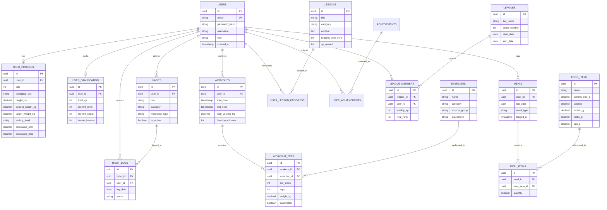

# Entity-Relationship Diagram: Fitora

This document presents the conceptual Entity-Relationship (ER) model for the **Fitora** platform.

> **Note**: This is a conceptual data model representing business entities and relationships. Field names and data types are indicative and subject to final technical schema implementation.

---

## 🗺️ Conceptual Entity-Relationship Diagram

---

## 📝 Planned Decisions / TODOs

- [ ] **TODO: [Data Modeling]**: Decide whether to store denormalized daily summaries (e.g., `daily_nutrition_summaries`) for faster dashboard query loading.
- [ ] **TODO: [Data Modeling]**: Finalize cascade delete behaviors (e.g., `ON DELETE CASCADE` for meal items vs. soft delete).
